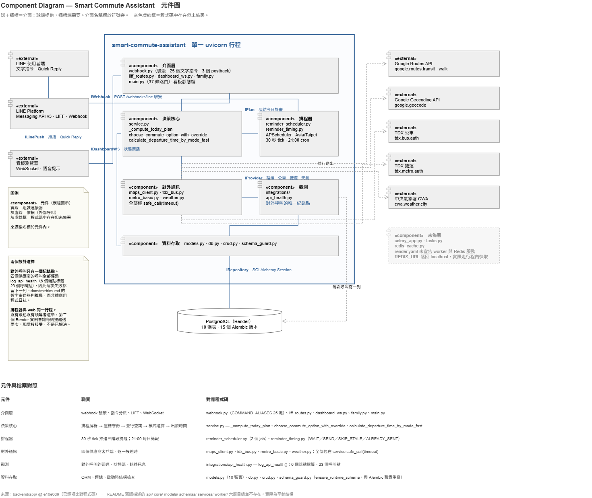

# Smart Commute Assistant — Multi-Modal Departure Planning Over LINE

A commute assistant deployed on Render and used daily in Taipei, developed over three months. It
answers one question — **what time do I leave, and by what route** — by querying four transport and
weather services at once, comparing bus, metro and Google's own suggestion against each other, and
delivering the answer at the moment it is needed rather than when it is asked for.

Route planning is not the hard part; Google answers that, and this system calls Google to get it.
Three things took the work. **Comparing modes honestly**, because an unrestricted routing query
returns the single itinerary the provider prefers and will not tell you how long the bus-only trip
would have taken. **Delivering the answer on time**, through a scheduler whose exactly-once property
comes from a relationship between two timing constants rather than from a lock. And **knowing when
to stop**, because a system that polls for a departure that already happened is a system that never
stops running.

What is here is a rule-based decision engine, a three-stage reminder scheduler with no lock and no
queue, and a shared household dashboard that recomputes whose turn it is on every poll instead of
advancing a pointer. Both of the latter two were built that way to avoid state that can get stuck,
and both are argued in Design. **It contains no learning components.**

---


*schedule setup → dashboard opens → T−60 reminder → T−5 countdown → departure confirmed → monitoring stops.*

---

## What it does

**Compares transport modes rather than reporting one.** The user can force bus, force metro, take
the system's own priority ordering, or ask for the shortest journey across all of them. Shortest
issues three concurrent routing queries with different `allowed_travel_modes` constraints and scores
the results against each other, because a single unrestricted query cannot answer the question.

**Folds weather into the same answer.** Rain probability adjusts the departure time directly, so
checking the forecast is not a second app to open before leaving.

**Delivers at three fixed offsets.** One hour before the computed departure time the dashboard shows
a prompt and speaks it. Five minutes before, again. At departure, LINE asks for confirmation.

**Stops when the user confirms.** Tapping 「已出門」 is the termination condition, not a logging step
— it is what ends the day's monitoring. The dashboard sleeps until eight hours before the next
departure and polls at five-minute intervals while asleep, thirty seconds while active. Without a
confirmation signal the system would poll around the clock for an event that already happened.

**Hands off between household members.** A shared dashboard — intended for a kitchen or hallway
display — ranks members by time-to-departure and monitors whoever is next. When one member confirms
departure they drop out of the ranking, and the next member becomes primary on the following poll.

---

## Scope

A solo personal project. Every component below is mine, so there is no ownership boundary to state —
which also means there was no code review, and that is recorded under
[Threats to Validity](#threats-to-validity).

| Component | Scope |
|---|---|
| **Decision engine** | Schedule resolution, coordinate precondition guard, concurrent provider fan-out, five-branch mode selection including three-way shortest comparison, per-mode departure formula |
| **Reminder scheduler** | Two APScheduler jobs. A 30-second tick advancing three stages through five timestamp guards, plus a 21:00 nightly brief. Exactly-once per stage per day without a lock or a queue |
| **Termination and sleep** | Departure confirmation as the stop signal; sleep/wake poll tiers so the dashboard is not computing when nobody is leaving |
| **Household handoff** | Members ranked by time-to-departure, recomputed on every poll. Stateless re-derivation rather than a queue with pointers, so a missed transition cannot leave the pointer stranded |
| **Provider integration** | Four services across six instrumented endpoints — Google Routes, Google Geocoding, TDX bus, TDX metro, CWA weather. Every call time-bounded, concurrent, and recorded |
| **LINE integration** | Messaging API v3 — webhook signature verification, 25 command keys over 60-odd surface spellings, Quick Reply, Flex Messages, 2 datetime-picker postbacks |
| **LIFF application** | Embedded schedule form with map-based origin and destination selection |
| **Dashboard** | Kiosk-oriented front end with a WebSocket channel carrying departure alerts and speech synthesis for the voice prompt |
| **Data model** | 10 tables, 15 Alembic revisions. `commute_logs` laid out as a supervised dataset by construction, though nothing writes to it; `api_health_logs` as an append-only provider record with no user reference |
| **Deployment** | Render web service and PostgreSQL, single process, scheduler in-process |

194 commits · 53 application source files · 12,315 Python LOC · 34 mounted HTTP routes ·
3 WebSocket endpoints · 25 LINE command keys · 2 scheduled jobs · 6 instrumented provider
endpoints · 10 tables · 15 migrations · 35 tests across 4 files, all passing.

Figures count `backend/` only. The four scripts under `scripts/` and `docs/diagrams/` are
documentation tooling, not part of the system, and are excluded — see
[`docs/metrics.md`](docs/metrics.md#scale). The test count is 35, not the 1,451 lines the files
contain: fourteen tests were removed because they grepped source for identifiers belonging to
removed features, which establishes nothing. Two of the remaining tests are marked
`expectedFailure` and document behaviour that is specified but not implemented
([C-11](docs/known-issues.md#c-11multi-leg-transfers-are-not-formatted)).

Development ran 22 April to 30 July 2026.

---

## Test Setup and Success Criterion

This is a personal deployment, not a study. One user — me — on one origin–destination pair in
Taipei, with my own provider accounts. Everything below describes an implementation exercised daily
against live third-party services; none of it characterises how the system would behave for anyone
else.

A morning is handled correctly when three things hold. **The suggested route reflects a comparison
that was actually made**, not the routing provider's default relabelled. **Each of the three
reminders is delivered exactly once, inside its window.** And **monitoring stops once departure is
confirmed.**

Only the first is verifiable from the data this system collects. The second is argued from code — the
window and tick constants, plus the guard columns — and is not instrumented. The third is observable
on the dashboard but recorded nowhere. That gap is the largest one between what this project claims
and what it demonstrates, and it is stated here rather than in a footnote.

---

## Measurement Basis

Repository figures are counted from the working tree at the commit below. Deployment figures come
from the production PostgreSQL instance and are collected by
[`scripts/collect_metrics.sql`](scripts/collect_metrics.sql); every derivation appears in
[`docs/metrics.md`](docs/metrics.md).

**Snapshot** 2026-08-27 · **Observation window** none — both evidence tables were empty when
measured, for the reasons given below

| Measurement | Value | Nature |
|---|---|---|
| Mounted HTTP routes | 34 + 3 WebSocket | Observed — route inventory |
| Instrumented provider endpoints | 6 across 17 call sites | Observed |
| Scheduled jobs | 2 | Observed |
| Provider calls per plan, `shortest` mode | 5 concurrent | Observed — design parameter |
| `commute_logs` rows | **0** | No producer exists in `backend/` |
| `api_health_logs` rows | **0** | Persistence raised `ImportError` on every call until 2026-08-27 |
| Provider call failure rate | not measured | Would be an **upper bound**, not a rate |
| Provider latency p50 / p95 | not measured | Would be a property of the test environment |
| Mode agreement, suggested vs actual | not measurable | Would be **confounded** — user and author are the same person |

**Both zeroes are structural.** `commute_logs` is never constructed anywhere in `backend/` — the
class appears twice outside `models.py`, an import and a `.delete()`. `api_health_logs` was written
through a crud function that did not exist; the resulting `ImportError` was caught by a bare
`except` and printed to stdout, which does not survive a Render restart. The second is fixed and
rows accumulate from that deploy onward. The first is not implemented. Full accounts as A-6 and C-9
in [`docs/known-issues.md`](docs/known-issues.md).

**The system works; the record of it does not exist.** Nothing above says the commute assistant
malfunctions. It computes plans, compares modes, delivers three reminders and stops on confirmation,
daily. What it does not do is retain any evidence that it did, which is a different failure and a
more embarrassing one for a project whose stated design is to be measurable.

**Nothing measures the scheduler either.** No table records reminder delivery. The exactly-once
property argued below is a code-level argument, not a measured result — and unlike the two above,
that was true by design rather than by defect.

**When these figures do arrive, three qualifications will govern them.** The provider failure rate
will be an upper bound rather than a rate, because a call counts as failed when `error_message` is
set or the status is 4xx, which conflates provider outages with this client's own 2.2–4.8 second
timeouts and with quota errors. Fill rate will be a bias figure rather than a sample-size figure,
because a missed tap produces NULL and the mornings least likely to be recorded are the rushed ones.
Mode agreement will be confounded, because the user is the author and reports after seeing the
suggestion. These are stated now so the criteria cannot be chosen after seeing the numbers.

---

## Problem Statement

A departure decision needs several answers at once and is only useful for a few minutes.

The routing question cannot be answered with one call. An unrestricted Google Routes query returns
the itinerary Google considers best; it does not report how long a bus-only journey would take, or a
metro-only one, because the alternatives are absent from the response. Comparing modes means asking
the same question three times under different constraints, then reconciling those answers with live
bus arrival from TDX and rain probability from the Central Weather Administration — four providers,
four independent failure modes, queried fresh for every plan.

None of those failures is loud. `safe_call` catches every exception and returns `None`, so a provider
going down does not raise — it removes one input from a calculation that proceeds anyway. Weather
unavailable means the rain buffer silently becomes zero. Geocoding unavailable meant, for a period,
that coordinates were `None`, every downstream call failed on them, and the user received a plausible
generic transit suggestion instead of an error. It took a long time to notice, because nothing
behaved like it was broken.

And an answer that arrives at the wrong time is not an answer. The plan is only useful an hour
before, five minutes before, and at the moment of departure — which means a scheduler that fires each
stage exactly once, and then **stops**. A polling loop with no termination condition is the default
failure mode of this kind of system: it keeps computing a departure that already happened, for a user
who already left. Making a human confirmation the stop signal is the cheapest correct answer, and it
produces the outcome record as a side effect rather than as its purpose.

---

## System Architecture



| Layer | Stack | Responsibility |
|---|---|---|
| Interface | FastAPI · LINE SDK v3 · LIFF | Webhook signature verification, command dispatch, schedule form, WebSocket alerts |
| Decision core | Python · asyncio | Schedule resolution, guards, provider fan-out, mode selection, departure time |
| Scheduler | APScheduler | 30-second tick, 21:00 cron, in-process |
| Providers | httpx | Google Routes · Google Geocoding · TDX bus · TDX metro · CWA weather |
| Data | SQLAlchemy · PostgreSQL · Alembic | 10 tables, 15 revisions |

One service, one process, one database. There is no second service and no message broker, because
the system has one writer and one workload; the failure surface worth attention is the boundary with
providers, and adding services would have moved effort away from it.

The cost is structural and is not hidden: APScheduler runs inside the web process with no lock and no
leader election. A second Render instance would run a second copy of the tick, and the guard columns
would not prevent double delivery, because the check and the write are not atomic. **Horizontal
scaling is unavailable by design, and the fix — a database advisory lock or an external scheduler — is
known and simply has not been needed.** Recorded as C-8 in
[`docs/known-issues.md`](docs/known-issues.md).

---

## Design

### Comparing transport modes requires asking three times

An unrestricted Google Routes query returns the single itinerary Google considers best. It does not
report how long a bus-only journey would take, or a metro-only one; the alternatives are absent from
the response entirely.

The first implementation of "shortest time" called Routes once and presented the result as the
fastest mode. That was one call and it was wrong — it reported the provider's preference, not a
comparison. The current implementation issues three Routes queries with different
`allowed_travel_modes` constraints and scores them against each other by `duration_minutes`.

Because the three run concurrently under `asyncio.gather`, alongside the TDX and weather calls, the
honest version costs the same wall clock as the dishonest one: about 4.2 seconds rather than 12.6.
The accepted cost is three times the quota consumption, on a mode the user selects explicitly.

### Exactly-once from two mechanisms, neither sufficient alone

**At least once** comes from `EXACT_TRIGGER_WINDOW_SECONDS` (75) being greater than
`SCHEDULER_TICK_SECONDS` (30): at least one tick necessarily lands inside every window, so no stage
can be missed. **At most once** comes from the corresponding `*_sent_at` column, checked before
sending and written on send, so the two or three ticks that do land inside a window produce one
message.

`75 / 30 = 2.5`, so a window is sampled two or three times depending on phase — never zero, never a
guaranteed one. The guard columns are therefore load-bearing rather than defensive, and this is why
delivery is exactly-once without a lock, a queue, or an exact-time trigger.

The constraint this creates is easy to violate. Compressing the offsets to shorten a demonstration —
say `one_hour → 90 s` and `five_min → 30 s` — while leaving the window at 75 makes the three windows
overlap, and all three stages fire on the same tick. The window is not an independent constant; it is
bounded below by the tick interval and above by the minimum offset spacing.

### Human confirmation as the termination condition

The scheduler ticks every 30 seconds against every active schedule. Nothing in the transport data
tells the system that a user has left — a departure is not an event any provider reports. Without a
stop signal, the tick keeps evaluating a plan whose moment has passed.

Tapping 「已出門」 writes `departed_at`, and the tick skips any row carrying it before evaluating a
single window. Around that sits a sleep tier: the dashboard sleeps until eight hours before the next
departure and polls every five minutes while asleep, thirty seconds while active.

The accepted cost is that the termination signal is voluntary. A user who does not tap leaves the row
live until `T + 120`, after which it goes stale silently — no escalation, no retry, no notification
that monitoring ended. That silent path is also why the outcome columns in `commute_logs` are
populated only for confirmed mornings, which shapes everything in
[Threats to Validity](#threats-to-validity).

### Household handoff by re-derivation, not by pointer

A shared dashboard is meant to sit on a wall and show whoever is leaving next. The obvious
implementation is a queue with a pointer that advances on each confirmation.

The implementation here does not do that. On every poll it ranks all household members by
time-to-departure, discards anyone not scheduled or already departed, and takes the first as primary.
Nothing is stored between polls.

The reason is failure recovery. A pointer that fails to advance — because a confirmation arrived
during a restart, or two members confirmed within the same tick — leaves the display stuck on someone
who has already left, with no obvious signal that anything is wrong. Recomputing from the schedule
table means the display is correct on the next poll regardless of what happened during the last one.
The accepted cost is a sort on every request, which at household scale is not a consideration.

### Compute once, then only compare timestamps

Recomputing the route on each 30-second tick would mean roughly 2,880 provider calls per user per day
— and, worse, each recomputation could return a different departure time, so the three reminders in
one morning could disagree with each other about when to leave.

The plan is instead computed once and written to `frozen_plan_key`, `frozen_departure_time` and
`frozen_reminder_text`. Every later tick reads those columns, which is what makes the timing property
below checkable at all.

The accepted cost is staleness. A frozen plan does not react to traffic that develops after it was
computed. A missing plan is refreshed, throttled by `PREPARE_RETRY_SECONDS`; a merely old one is not.

### Fail loudly where the precondition is load-bearing

Uniform degradation is wrong when the inputs are not uniformly optional. Weather is an enrichment — a
suggestion without a rain buffer is still useful. Coordinates are a precondition — without them, every
provider call downstream is meaningless.

The first implementation treated them the same. When the Google Geocoding API stopped serving requests
after the free trial expired, latitude and longitude came back `None`, were stored, were read back,
and were passed into provider calls that each failed on them — and each of those failures was caught
by `safe_call` and converted to `None`. The pipeline ran to completion and produced a well-formed
answer. It did not read as an error; it read as a less specific suggestion.

The fix is a precondition check at the point where coordinates become load-bearing, returning
`coords_missing` and naming which side failed. It is the only branch in the pipeline where a missing
external answer produces a visible error rather than a plausible one. Full account as A-1 in
[`docs/known-issues.md`](docs/known-issues.md).

---

## Evaluation

Running the collection script on 2026-08-27 returned zero rows from both tables the design depends
on. Neither zero was a data-loss event, and finding out why produced the most transferable result in
this project.

`api_health_logs` had a producer that could not run. It imported a crud function that did not exist;
the `ImportError` was caught by a bare `except Exception` and printed to stdout, which Render's free
tier discards on the next spin-down. That table exists *because* provider failures were being lost to
`print()` on restart. The persistence layer built to fix that was disabled by the same pattern one
layer up, and the notice announcing it went to the same place, and was lost the same way.

`commute_logs` has no producer at all — `CommuteLog` is never constructed anywhere in `backend/`.

Both were found by querying the database. Neither would have surfaced from reading the code, running
the tests, or using the system daily, which I had been doing for three months.

The crud function is now in place and rows accumulate from that deploy onward. `commute_logs` remains
unimplemented and is recorded as C-9. When the tables have content, this section gains three parts:

| Measure | Derivation | What it would show |
|---|---|---|
| Provider reliability | Per-endpoint failure rate and latency percentiles from `api_health_logs` | The conditions the decision engine had to hold under |
| Failure clustering | Daily failure counts against daily call counts | Whether outages are bursty or background |
| Departure delta | `actual_departure_time − suggested_departure_time`, cast from `VARCHAR` with a regex guard | How far the suggestion was from the behaviour |

**A stated absence is a better result than a thin number.** That principle was written into this
document before the tables were queried, which is why this section reads the way it does rather than
quoting something assembled afterwards.

Two measures will not appear regardless of the data. There is no end-to-end latency figure, because
request handling is not instrumented — only provider calls are. And there is no empirical verification
of the exactly-once property, because no table records whether a reminder fired inside its window.

Full derivations, including the queries and the rows each one excludes, are in
[`docs/metrics.md`](docs/metrics.md).

---

## Threats to Validity

[`docs/known-issues.md`](docs/known-issues.md) holds the complete set, each classified by whether it
was verified against source or against the database.

**External validity — n = 1.** One user, one city, one origin–destination pair, one set of provider
accounts. The provider figures characterise those accounts over that window from this client with
this system's timeouts applied; they are not a statement about Google, TDX or the CWA. The household
handoff has been exercised with a small number of schedules, not with a household under load.

**Construct validity — the outcome is neither observed nor, currently, recorded.**
`actual_departure_time` would come from a tap on a Quick Reply, and `is_late` from a judgement
nothing in the system asks for. Neither is measured independently, and as of C-9 neither is written
at all.

**Internal validity — the user is the author, and no one else read the code.** Mode agreement would
compare a suggestion against a behaviour by someone who saw the suggestion and wrote the rule that
produced it. More consequentially, there was no code review at any point, and three of the defects in
`known-issues.md` are the kind review catches in minutes: an entire unmounted router carrying the
household and voice features, a tested module the running code does not import, and a persistence
function that was called but never written.

**Instrumentation — almost nothing was actually recorded.** The scheduler was never instrumented by
design: no table records reminder delivery, so the exactly-once argument rests on two constants and a
set of guard columns verified by reading the code. Provider calls *were* instrumented, at 17 call
sites, and none of it reached the database until 2026-08-27. Between design and defect, this project
ran for months producing no retained evidence of its own behaviour.

**Configuration — degradation runs toward optimism.** When the weather call fails, the buffer becomes
zero and the system advises leaving later than the rules would otherwise produce, silently. The
failure direction is unsafe, and it is most consequential on exactly the mornings when weather
mattered. Every failed call already writes a row at the moment it fails; nothing reads those rows at
request time to annotate the reply. That is the smallest available fix and it is not implemented.

---

## Open Problems

The first is whether a decision log can be used to replace the policy that generated it.
`commute_logs` stores (features, action, outcome) by construction, and the obvious formulation is a
regression on one number — predict the buffer that would have produced on-time arrival with the least
excess waiting, with the current hand-written rule table as the baseline. What makes it non-trivial is
that the actions were never randomised. Every row records what this policy chose under conditions this
policy created, so evaluating an alternative offline requires assumptions about overlap that nothing in
the deployment establishes.

That problem sits on top of a measurement one. Termination depends on a voluntary tap, which is both
the stop signal and the only source of outcome data. Missingness is therefore correlated with the
label: a user who forgets to tap produces a NULL, and the mornings least likely to be recorded are the
rushed ones — the class `is_late` is about. Recovering departure from signals already present, rather
than from a button, would improve the system and the dataset in the same change.

The third came out of the instrumentation itself. The provider failure rate this system can compute
conflates three things — a provider outage, a timeout this client imposed at between 2.2 and 4.8
seconds, and a quota error — because the logging records that a call returned nothing usable without
recording why. Separating a failure from the artifact of its recording is a problem I have now hit from
both directions: once when the failures were invisible, once when the record of them was.

**The kiosk shaped the architecture.** The dashboard was built for a Raspberry Pi on a hallway wall,
which is why it speaks rather than notifies and why the household handoff exists at all — a shared
display has to know whose turn it is. Running it in a browser is the fallback, not the design.

These are the questions I want to work on. What is here is the layer underneath a learned policy: a
hand-written baseline that says so, instrumented well enough to show where its own data would fail to
support the replacement.

---

## Repository Layout

```
.
├── backend/
│   ├── app/
│   │   ├── main.py                 App composition, route declarations, lifespan
│   │   ├── webhook.py              LINE entry point, 25 command keys, signature verification
│   │   ├── service.py              Decision engine — _compute_today_plan and mode selection
│   │   ├── reminder_scheduler.py   Two APScheduler jobs, three trigger windows
│   │   ├── reminder_timing.py      Timing decision enum (see known-issues D-1)
│   │   ├── dashboard.py            Kiosk routes, household queue, sleep/wake tiers
│   │   ├── dashboard_page.py       Kiosk front end — WebSocket client, speech, queue panel
│   │   ├── dashboard_ws.py         WebSocket channel for departure alerts
│   │   ├── commute_schedule.py     Schedule resolution and dashboard_should_sleep
│   │   ├── models.py               10 SQLAlchemy models
│   │   ├── schema_guard.py         Boot-time schema repair (see known-issues C-7)
│   │   ├── google_maps.py          Proxy to the Routes and Geocoding client
│   │   ├── tdx_bus.py              TDX bus stops and live arrival
│   │   ├── metro_basic.py          TDX metro stations
│   │   ├── weather.py              CWA forecast and the buffer rule
│   │   ├── integrations/
│   │   │   ├── Maps_client.py      Google Routes and Geocoding
│   │   │   └── api_health.py       log_api_health — the single recording point
│   │   └── static/                 Dashboard assets
│   ├── alembic/versions/           15 revisions
│   └── requirements.txt
├── tests/                          4 files, 1,451 lines
├── scripts/
│   ├── collect_metrics.sql         Every derivation in docs/metrics.md
│   ├── collect_repo_stats.py       Scale table and route inventory
│   └── export_data_scrubbed.py     PII-stripped export for data/
├── data/                           Scrubbed exports backing docs/metrics.md
├── render.yaml                     Deployment blueprint
├── .env.example
└── docs/
    ├── architecture.md             Request lifecycle, provider concurrency, known deviations
    ├── state-machines.md           The reminder progression and its timing invariant
    ├── decision-engine.md          Every rule, every threshold, every degradation path
    ├── database.md                 Data dictionary for all 10 tables
    ├── api.md                      Route inventory grouped by caller
    ├── metrics.md                  Derivation of every figure in this README
    ├── known-issues.md             Verified defects and open questions
    ├── diagrams/                   Editable draw.io sources
    └── images/
```

## Tech Stack

**Back end** Python · FastAPI · SQLAlchemy · PostgreSQL · Alembic · APScheduler · asyncio
**Messaging** LINE Messaging API v3 SDK · LIFF · Flex Messages · Quick Reply
**Providers** Google Routes API · Google Geocoding API · TDX Transport Data eXchange · Central Weather Administration Open Data
**Front end** WebSocket · Web Speech API
**Infrastructure** Render · Docker

## Running Locally

```bash
cp .env.example backend/.env      # supply your own credentials
cd backend
pip install -r requirements.txt
alembic upgrade head
uvicorn app.main:app --reload
```

Requires a LINE Messaging API channel, a Google Cloud project with Routes and Geocoding enabled and
billing active, a TDX account, and a CWA Open Data key. The application starts without them, but
`_compute_today_plan()` returns `coords_missing` on the first request, which is the intended
behaviour rather than a failure to configure.

`db.py` uses `sqlalchemy.create_engine`, which is synchronous — an async driver will not work. On
Python 3.14 without build tooling, `psycopg2` fails to compile; install `pg8000` and use
`postgresql+pg8000://` instead.

---

## Author

**Stephanie Lin, Yen Yu**
Personal project · April – July 2026 · Taipei

Built and used daily against live third-party services. Shared for portfolio purposes.
