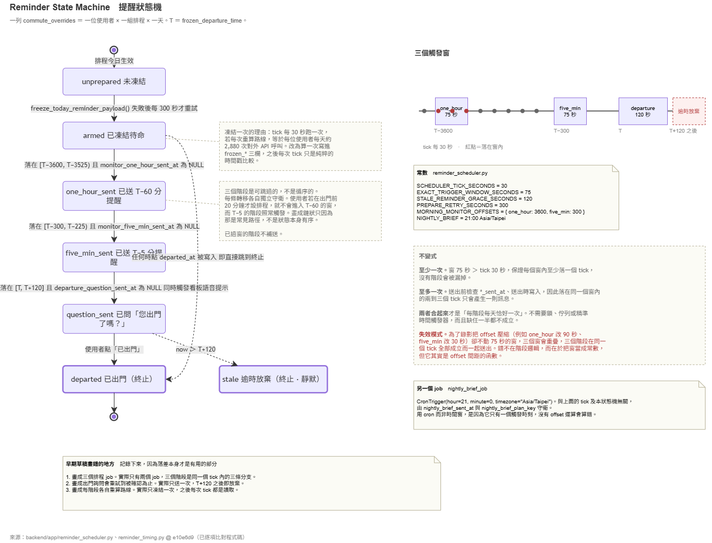

# State Machines

This system has one state machine: the progression of a single `commute_overrides` row through a
morning. There is no status column — the state is the pattern of NULLs across five timestamp
columns, and each transition is guarded independently.

**Editable sources** [`diagrams/`](diagrams/) — open with draw.io

---

## Reminder progression



One row of `commute_overrides` corresponds to one user, one schedule, one date.
**T** throughout means `frozen_departure_time`.

| State | Represented by |
|---|---|
| `unprepared` | row absent, or any of the three `frozen_*` columns NULL |
| `armed` | all three `frozen_*` columns populated |
| `one_hour_sent` | `monitor_one_hour_sent_at` NOT NULL |
| `five_min_sent` | `monitor_five_min_sent_at` NOT NULL |
| `question_sent` | `departure_question_sent_at` NOT NULL |
| `departed` | `departed_at` NOT NULL — terminal |
| `stale` | no column; the row simply stops being selected once `now > T + 120` |

**Stages are skippable, not sequential.** Each transition is guarded on its own window and its own
column. A user who creates a schedule 20 minutes before departure never enters the `T − 3600`
window; the `T − 300` stage still fires normally. The diagram is drawn as a chain because that is
the common path, not because the states are ordered by construction.

**A window that has already passed is not backfilled.** There is no catch-up. If the service was
asleep during the `T − 300` window, that reminder does not arrive late — it does not arrive.

**`departed` short-circuits everything.** The tick skips any row with `departed_at` set before
evaluating any window, so tapping 「已出門」 at any point ends the day's progression immediately.

---

## Trigger windows

| Stage | Window | Constant |
|---|---|---|
| `one_hour` | `[T − 3600, T − 3525)` | `MORNING_MONITOR_OFFSETS["one_hour"] = 3600` |
| `five_min` | `[T − 300, T − 225)` | `MORNING_MONITOR_OFFSETS["five_min"] = 300` |
| departure question | `[T, T + 120]` — inclusive both ends | `STALE_REMINDER_GRACE_SECONDS = 120` |
| stale | `now > T + 120` | same constant |

The first two windows are 75 seconds wide (`EXACT_TRIGGER_WINDOW_SECONDS`) and half-open. The
third is 120 seconds wide and closed, because it uses the staleness grace period rather than the
trigger window — a deliberate asymmetry, since a missed departure question costs more than a
missed advance warning.

All comparisons are on seconds-of-day in `Asia/Taipei`, computed from
`now.hour * 3600 + now.minute * 60 + now.second`. Nothing here is date-aware; a schedule whose
departure crosses midnight is undefined behaviour and is not currently reachable, since
`commute_schedules.time` is a target *arrival* time and departure is always earlier the same day.

---

## The invariant

Delivery is exactly-once per stage per day, and this rests on two separate mechanisms. Neither is
sufficient alone.

**At least once.** `EXACT_TRIGGER_WINDOW_SECONDS` (75) is greater than `SCHEDULER_TICK_SECONDS`
(30), so at least one tick necessarily falls inside every window. No stage can be missed.

**At most once.** The corresponding `*_sent_at` column is checked before sending and written on
send. The two or three ticks that do land inside a window therefore produce exactly one message.

`75 / 30 = 2.5`, so a window is sampled two or three times depending on phase — never zero, never a
guaranteed one. This is why the guard columns are load-bearing rather than defensive.

**Failure mode.** Compressing the offsets for a demonstration — say `one_hour → 90` and
`five_min → 30` — without also shrinking the 75-second window makes the windows overlap. All three
stages then satisfy their conditions on the same tick and fire together. The defect is not in the
stage logic; it is that the window was treated as a constant when it is a function of the offset
spacing. Recorded in
[`known-issues.md`](known-issues.md#a-2compressed-timing-constants-fire-all-three-stages-on-one-tick).

---

## What one tick does

```
1.  get_all_schedules_for_day(weekday)
2.  ensure_today_reminders_prepared()
      for each schedule with no frozen plan:
        skip if a prepare was attempted < PREPARE_RETRY_SECONDS (300) ago
        else freeze_today_reminder_payload()   ← the only external calls on a tick
3.  SELECT * FROM commute_overrides
      WHERE target_date = today
        AND user_id IN (active)  AND schedule_id IN (active)
        AND frozen_plan_key IS NOT NULL
        AND frozen_departure_time IS NOT NULL
        AND frozen_reminder_text IS NOT NULL
4.  per row:
      skip if departed_at IS NOT NULL
      skip if schedule missing or reminder_enabled IS FALSE
      skip if now_sec > departure_sec + 120
      for monitor_key in (one_hour, five_min):
        send if not already_sent and inside [trigger, trigger + 75)
      send question if not sent and inside [departure, departure + 120]
```

Steps 3 and 4 are pure timestamp comparison. Step 2 is the only part that can touch a provider,
and only when a schedule is unprepared.

The in-memory `_PREPARE_ATTEMPT_CACHE` that throttles step 2 is a module-level dict, so it resets on
restart. A restart loop would therefore retry preparation on every tick rather than every 300
seconds.

---

## Departure confirmation

`_send_departure_question()` does two things and treats them differently.

The LINE push carries a Quick Reply — `DEPARTURE_CONFIRM_QR`, a single `✅ 已出門` button that
sends the literal text `已出門`. That text resolves through `COMMAND_ALIASES["departed"]` on the
next webhook and writes `departed_at`. If the push fails, `departure_question_sent_at` is not
written, so the next tick inside the window retries.

The WebSocket voice alert to the dashboard is fired separately and its failure is caught and
logged without affecting the LINE path. It sets `alert_status = "pending"`; the dashboard writes
`acknowledged` when a viewer dismisses it. `alert_status` is not part of the reminder progression
and does not gate anything.

---

## Nightly brief

A separate APScheduler job, `CronTrigger(hour=21, minute=0, timezone="Asia/Taipei")`, guarded by
`nightly_brief_sent_at` and `nightly_brief_plan_key`. It is not part of the state machine above.

A cron trigger is used rather than a window because there is exactly one firing time and no offset
arithmetic that can be got wrong. The two jobs are the entire scheduler — three reminder stages are
three branches inside one tick, not three jobs.

---

## Verified deviations from earlier diagram drafts

An earlier version of this diagram, drawn from the README rather than from the code, contained
three claims that do not hold. They are recorded because the discrepancy is the instructive part.

1. **Three scheduled jobs.** There are two: `check_and_send_departure_reminders` at 30-second
   intervals and the 21:00 cron. The three stages are branches inside the first.
2. **The departure question retries until acknowledged.** It fires once. After `T + 120` the row is
   skipped, silently, with no error and no escalation.
3. **The plan is recomputed at each stage.** It is frozen once by
   `freeze_today_reminder_payload()` and read thereafter. A stage cannot disagree with the stage
   before it about the departure time, because they read the same column.

---

**Source** `backend/app/reminder_scheduler.py`, `backend/app/reminder_timing.py` @ `e10e6d9` —
verified line by line
